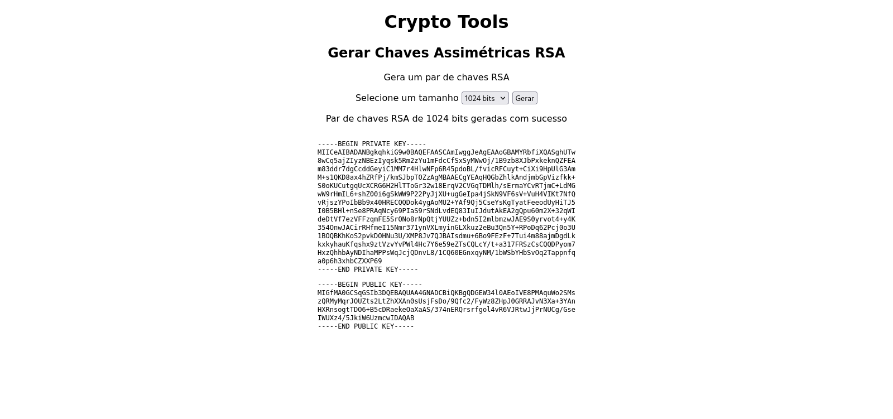

# Crypto Tools

A web application made with Flask that allows the use of some cryptography tools like message digest, RSA key pair generation and a decipher of AES 128 ECB that requires a link to an encrypt file and a password.

## Website running



## Dependencies 

- cryptography
- flask

## How to install dependencies

```
$ python3 -m pip install -r requirements.txt
```

## How to run

```
$ python3 main.py
```

### How to open

Go to http://127.0.0.1:5000/


## Tests

You can test the decipher with the following link and password:

link:
https://drive.google.com/uc?id=18denp1JMqoxGKlynJkZbg6j7vMXdljcU&export=download

password: inerenteinerente